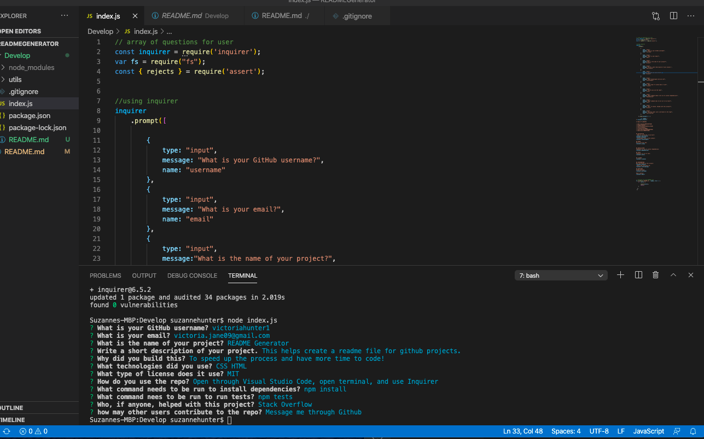
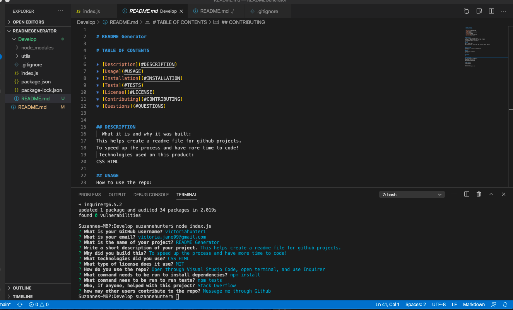

# READMEGenerator

In this project, I created a generator that will make a customized ReadMe for the user as long as they answer some easy questions. It uses Node.js, javascript, and Inquirer. 

The link to the repository is: https://github.com/victoriahunter11/READMEGenerator

Here is what the page looks like when you are answering questions:

Here is the ReadMe that it generates for you:

